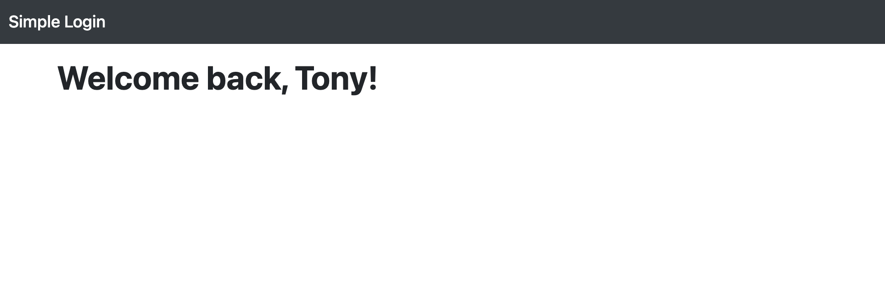

# 帳密檢查機制
簡易使用者登入驗證網頁
## 功能
* 使用者在首頁表單裡可輸入帳密：email & password
* 發送表單，會將帳密傳送給伺服器比對內建的使用者名單
* 若資料錯誤，就彈回登入頁並且在介面上顯示「Username 或Password 錯誤」
* 若資料正確，使用者就進入自己的 welcome page，在此頁面上會顯示登入使用者的 firstName。

### 頁面設計




## Getting Started
**Clone respository**
```
$ git clone https://github.com/jilltu330/user-login.git
```
**Install by npm**
```
$ npm install
```
**DB Seed**
```
$ npm run seed
```
**Execute**
```
$ npm run dev
```
**Browse the website on localhost**
```
http://localhost:3000/
```

## Built With
* Node.js (v10.15.0)
* Express (v4.17.1)
* Express-Handlebars (v5.3.2)
* Mongoose (^5.12.14)